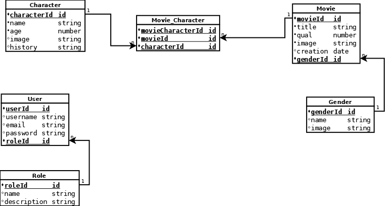

    
   <table id="vertical-1">
        <caption></caption>
        <tr>
            <th>NAME</th>
            <td>Challenge Alkemy</td>
        </tr>
        <tr>
            <th>DESCRIPTION</th>
            <td>Este proyecto consta en Desarrollar una API para explorar el mundo de Disney, la cual permitirá conocer y modificar los
personajes que lo componen y entender en qué películas estos participaron. Por otro lado, deberá
exponer la información para que cualquier frontend pueda consumirla.</td>
        </tr>
        <tr>
            <th>PLATFORM</th>
            <td>Web API</td>
        </tr>
        <tr>
            <th>ARCHITECTURE</th>
            <td>REST</td>
        </tr>
        <tr>
            <th>AUTH</th>
            <td>Yes</td>
        </tr>
        <tr>
            <th>TECHNOLOGIES</th>
            <td> 
           </td>
        </tr>
        <tr>
            <th>API URL</th>
            <td><a href="http://localhost:3000/api/v1" target="_blank">http://localhost:3000/api/v1</a>
            </td>
        </tr>
        <tr>
            <th>DOCS</th>
            <td><a
                    href="http://localhost:3000/api-docs">http://localhost:3000/api-docs</a>
            </td>
        </tr>
        <tr>
            <th>WEB</th>
            <td>No</td>
        </tr>
        <tr>
            <th>MOBILE</th>
            <td>No</td>
        </tr>
   </table>

## Database | SQL

## Local Development
### Requerimients
```
Node.js
https://nodejs.org/en/download/

MariaDB | MySQL | PostgreSQL
https://mariadb.org/download/?t=mariadb
https://www.mysql.com/downloads/
https://www.postgresql.org/download/
```
### Git Repository
```
git clone https://github.com/migueldev81/node-alkemy-challenge
```
### Variables Enviroment (.env)
````
DATABASE_URL=
PASS_SEC=
JWT_SEC=
````
### SQL Console(No Remote)
````
CREATE DATABASE [database];
````
### Start Project
```
npm install
```
```
npm run dev
```

