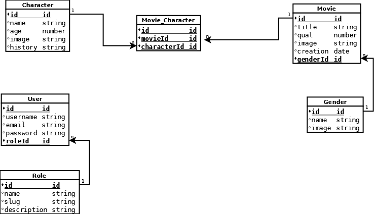

<table>
            <caption></caption>
            <tr>
                <th>NAME</th>
                <td>Aljemy Chellenge</td>
            </tr>
              <th>DESCRITPION</th>
                <td>Backend for challenge the organization alkemy</td>
            <tr>
                <th>API URL</th>
                <td>asdpp</td>
            </tr>
             <tr>
                <th>SWAGGER DOCUMENTAION</th>
                <td>asdpp</td>
            </tr>
            <tr>
                <th>WEB</th>
                <td>asdpp</td>
            </tr>
            <tr>
                <th>Header 2</th>
                <td>data</td><td>data</td><td>data</td>
            </tr>
        </table>

## API URL
[https://node-challenge-migueldev81.herokuapp.com/api/v1](https://node-challenge-migueldev81.herokuapp.com/api/v1)
## Swagger Documentation
[https://node-challenge-migueldev81.herokuapp.com/api-docs](https://node-challenge-migueldev81.herokuapp.com/api-docs)
## Database | SQL

## Local Development
### Requerimients
```
Node.js
PostgreSQL
```
### Git Clone
```
git clone https://github.com/migueldev81/node-alkemy-challenge
```
### Variables Enviroment (.env)
````
DB_URL=
PASS_SEC=
JWT_SEC=
````
### SQL Console(No Remote)
````
CREATE DATABASE [database];
````
### Start Project
```
npm install
```
```
npm run dev
```

